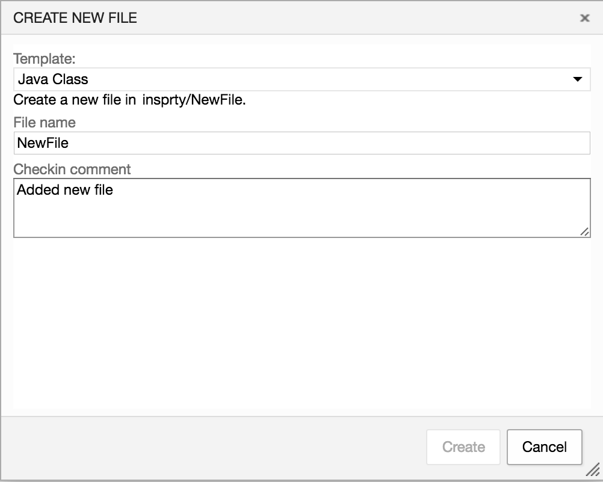
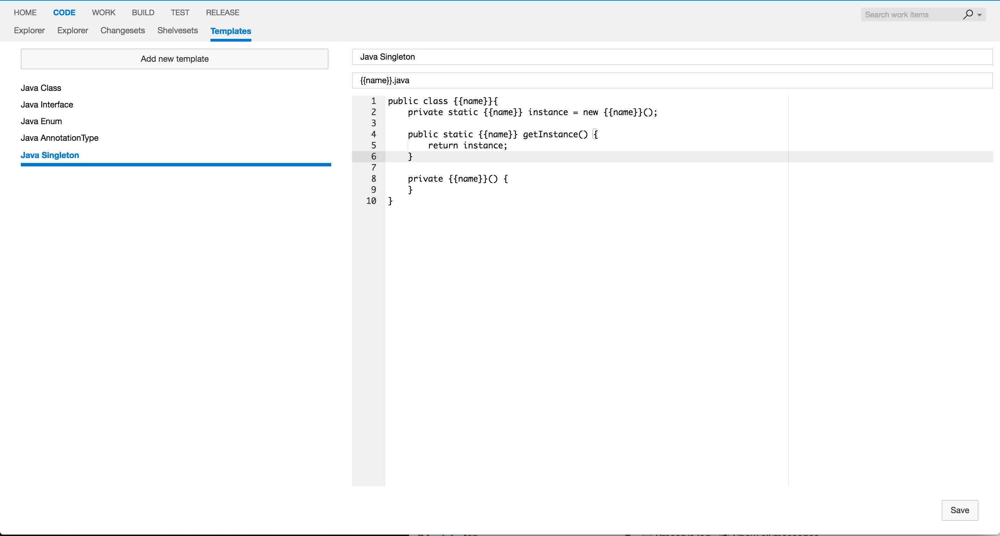

## Create files from templates ##

In Visual Studio Team Services you can add, edit, and delete files right from the web. However, if you need to create files
from the specific template it's not that easy. This extension provides a way to create files from templates that you can
specify yourself.

Works with both Git and Team Foundation Version Control source repositories.

## Quick steps to get started ##

1. From the Code hub (Explorer subhub), select a folder to create the new file under.
2. Right-click and select **Create a new file from template**.
3. Specify a template, file name and an optional checkin comment. Click on **Create**.
4. The new file from template is created.

## Steps to add or change template ##

1. From the Code hub (Templates subhub), click on  **Add new template** button in top left corner.
2. Specify name of the template, name template and the template itself.
3. Press **Save** button in the bottom right corner.
4. Now you can use your new template to create files.

## Future work ##

* Add dynamic properties to add to template(currently only {{name}} (name of the file) is supported)

## How to build ##

1. Clone the project.
2. npm install
3. typings install
4. npm run build
